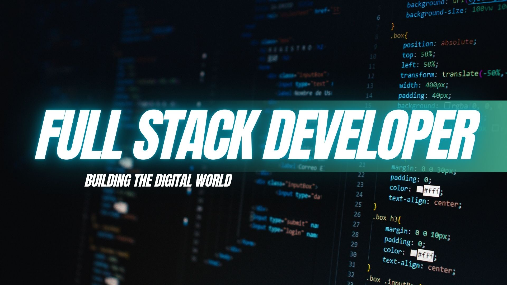

# 👋 Hi, I'm Joy Shadman  

### 🚀 Full Stack Developer | Passionate about Crafting Engaging User Experiences  

💡 Currently focused on building modern, responsive, and scalable websites with seamless UI/UX.  

---

<!-- Banner Image -->

  

---

## 🌐 Connect with Me  

  

---

## 💻 Tech Stack  

### 🎨 Frontend  
  
  
  
  
  
  
  

### ⚙️ Backend & Languages  
  
  

### 🛠️ Tools & Design  
  

---

## 📊 GitHub Stats  

  
  

---

## 🏆 Profile Views  

  

  

---

✨ *Always open to collaborations, exciting projects, and learning opportunities!*  
